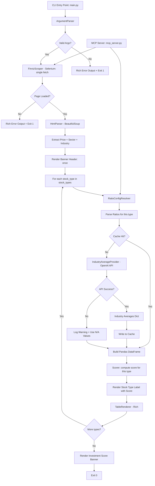

# Design Document: Stock Screener CLI

## Overview

The Stock Screener is a Python 3.11.1 (managed via pyenv) application that retrieves and displays financial ratios for dividend, growth, and value stocks. It provides two interfaces: a CLI for direct terminal use and an MCP (Model Context Protocol) server for programmatic access by LLM clients. It scrapes data from finviz.com using Selenium with a headless browser, parses the HTML with BeautifulSoup, fetches industry-average values via the OpenAI API, loads all data into a Pandas DataFrame, and renders a styled five-column table to the terminal using Rich.

The application supports multiple stock types in a single invocation via a comma-separated second argument (e.g., `python main.py AAPL growth,value`). When multiple types are requested, the application fetches the ticker's HTML page once, renders a single banner header listing all types, and produces one ratio table per stock type — each preceded by a stock-type label showing the investment score for that type. Cache and industry-average operations are performed independently per stock type within the same run.

The application includes an investment scoring system that compares each ratio's real-time value against its industry average using a context-dependent `compare_direction` field on `RatioInfo`. Each ratio where the stock "beats" the industry average increments the score by 1. Per-type scores are displayed in the stock-type label (e.g., `div: 2 / 3`), and a cumulative Investment Score banner is rendered at the end with color-coded percentage (green >70%, yellow 50-70%, red <50%). The scoring logic is encapsulated in a dedicated `Scorer` class in `stock_screener/scorer.py`.

The application follows Object-Oriented Programming throughout. All modules use strict type hints on every parameter and return type. File, method, and variable names use snake_case. Code follows PEP 8 standards with grouped and length-ordered imports. All I/O operations use try-except blocks.

Key technology choices driven by steering rules:
- Selenium (not requests) for web scraping — handles JavaScript-rendered content and cookie consent
- Pandas DataFrame as the intermediate data structure for ratio data before rendering
- Rich for colored/styled terminal output (not raw ANSI escape codes)
- BeautifulSoup4 for HTML parsing
- openai Python SDK for fetching industry-average ratio values from the OpenAI chat completions API

## Architecture



The application has two entry points:
1. **CLI** (`main.py`): Parses CLI args → runs the full pipeline → renders styled terminal output via Rich
2. **MCP Server** (`mcp_server.py`): Receives tool calls from LLM clients → runs the same pipeline using the same classes → returns structured JSON data

Both entry points share the same backend components: `FinvizScraper`, `HtmlParser`, `RatioConfigResolver`, `IndustryAverageProvider`, `IndustryAverageCache`, and `Scorer`. The CLI path uses `TableRenderer` for styled output; the MCP path builds plain dicts instead.

The pipeline is: parse CLI args (ticker, stock_types list, `--api-key`, `--no-cache`, `--refresh`) → fetch finviz page once via Selenium → parse HTML with BeautifulSoup (price, sector, industry) → render banner header once with all stock types → **loop per stock type**: resolve ratio set → parse ratios from cached HTML → check cache for industry averages → on miss: fetch via OpenAI API with sector/industry context and write to cache → build five-column DataFrame → compute investment score via `Scorer` → render stock-type label with score → render styled table via Rich → **after loop**: render cumulative Investment Score banner.

## Components and Interfaces

### 1. `stock_screener/cli.py` — ArgumentParser class (UPDATED for multi-stock-type support and ticker validation)

Encapsulates command-line argument parsing using `argparse`. Updated to parse comma-separated stock types, deduplicate preserving order, validate each type individually, and enforce single-ticker input with format validation via a custom argparse `type` function.

```python
from __future__ import annotations

import re
import os
import sys
import argparse


class ArgumentParser:
    """Parses and validates CLI arguments for the stock screener."""

    VALID_STOCK_TYPES: list[str] = ["div", "growth", "value"]
    TICKER_PATTERN: re.Pattern[str] = re.compile(r"^[a-zA-Z]+(-[a-zA-Z]+)?$")

    def __init__(self, argv: list[str] | None = None) -> None:
        self._argv: list[str] | None = argv
        self._parser: argparse.ArgumentParser = self._build_parser()

    def _build_parser(self) -> argparse.ArgumentParser:
        """Build the argparse parser with ticker, stock_type, and --api-key arguments."""
        ...

    @staticmethod
    def _validate_ticker(value: str) -> str:
        """Validate and normalize a single ticker symbol.

        Enforces two checks in order:
        1. Comma check — rejects multiple comma-separated tickers with a
           specific message directing the user to the MCP server.
        2. Format check — validates against TICKER_PATTERN regex, accepting
           alphabetic tickers (e.g., AAPL) and share-class tickers with a
           single hyphen (e.g., BRK-B).

        Returns the uppercase ticker on success.
        Raises argparse.ArgumentTypeError on failure.
        """
        ...

    def _parse_stock_types(self, raw: str) -> list[str]:
        """
        Split a comma-separated stock type string, deduplicate preserving
        first-occurrence order, and validate each type.

        Returns a list of unique, validated stock type strings.
        Prints error to stderr and calls sys.exit(1) if any type is invalid.
        """
        ...

    def parse(self) -> tuple[str, list[str], str, bool, bool]:
        """
        Parse arguments and return (ticker, stock_types, api_key, no_cache, refresh).

        stock_types is a list[str] — always at least one element.
        Reads --api-key from CLI arg first, falls back to OPENAI_API_KEY env var.
        Prints error to stderr and raises SystemExit if no API key is found.

        The ticker is already validated and uppercased by _validate_ticker
        at the argparse type level. An additional comma check in parse()
        serves as a belt-and-suspenders safety net.
        """
        ...
```

- The `ticker` positional argument uses `type=self._validate_ticker` to enforce validation at the argparse level
- New static method `_validate_ticker(value: str) -> str` performs two-stage validation:
  1. **Comma check**: if the value contains a comma, raises `argparse.ArgumentTypeError` with a message directing the user to the MCP server for multi-ticker screening
  2. **Format check**: validates against `TICKER_PATTERN` regex (`^[a-zA-Z]+(-[a-zA-Z]+)?$`), accepting alphabetic tickers (e.g., `AAPL`, `NKE`) and share-class tickers with a single hyphen (e.g., `BRK-B`, `BF-B`), while rejecting dots, numbers, spaces, and other special characters
  3. Returns the uppercase ticker on success
- The `parse()` method includes a redundant comma check on the ticker as a safety net, in case the argparse type constraint is bypassed in a future refactor
- The `stock_type` positional argument now accepts a comma-separated string (e.g., `growth,value,div`)
- New private method `_parse_stock_types(raw: str) -> list[str]` handles:
  1. Splitting on commas: `raw.split(",")`
  2. Stripping whitespace from each element
  3. Deduplicating while preserving first-occurrence order using a `dict.fromkeys()` pattern
  4. Validating each type against `VALID_STOCK_TYPES` — prints error identifying the invalid type and exits with code 1 on failure
- Return type changes from `tuple[str, str, str, bool, bool]` to `tuple[str, list[str], str, bool, bool]`
- A single stock type without a comma (e.g., `growth`) produces a one-element list `["growth"]`
- The help text for the `stock_type` argument is updated to indicate comma-separated values are accepted
- The help text for the `ticker` argument is updated to indicate single ticker only with share-class examples

Design decisions:
- `_validate_ticker` is a `@staticmethod` so it can be passed as the `type` parameter to `argparse.add_argument`
- Two-stage validation (comma check first, then regex) provides specific error messages: "only one ticker allowed" for commas vs "invalid ticker format" for other invalid characters
- `TICKER_PATTERN` is a class-level compiled regex for reuse and clarity
- The regex `^[a-zA-Z]+(-[a-zA-Z]+)?$` allows `BRK-B` style share classes used by Finviz while rejecting dots (used by other platforms like Yahoo Finance for the same purpose)
- `_parse_stock_types` is a separate method (not inline in `parse()`) for clarity and testability
- `dict.fromkeys()` is used for deduplication because it preserves insertion order in Python 3.7+ and is idiomatic
- Validation iterates the deduplicated list and exits on the first invalid type found, printing the specific invalid value in the error message

### 2. `stock_screener/ratios.py` — RatioInfo dataclass and RatioConfigResolver class (UPDATED for format-aware prompts and scoring)

Defines the ratio data model and provides lookup by stock type. Updated to include `format_type` metadata on each ratio so the OpenAI prompt can distinguish between percentage-based metrics and plain multiples, and `compare_direction` metadata to support investment scoring.

```python
from __future__ import annotations

from dataclasses import dataclass

@dataclass(frozen=True)
class RatioInfo:
    name: str              # Display name, e.g. "P/E"
    finviz_label: str      # Label text on finviz page
    optimal: str           # Optimal value description
    importance: str        # Importance description
    format_type: str       # "percentage" or "multiple" — controls prompt formatting
    compare_direction: str # "higher_is_better" or "lower_is_better" — controls scoring

class RatioConfigResolver:
    """Resolves the ratio set for a given stock type."""

    _RATIO_SETS: dict[str, list[RatioInfo]] = { ... }

    def get_ratio_set(self, stock_type: str) -> list[RatioInfo]:
        """
        Return the list of RatioInfo for the given stock type.
        Raises ValueError for unknown stock type.
        """
        ...
```

The `compare_direction` field determines how the `Scorer` compares a stock's real-time value against the industry average:
- `"higher_is_better"`: the stock scores a point if its real-time value > industry average (e.g., Dividend Yield, ROE, Gross Margin)
- `"lower_is_better"`: the stock scores a point if its real-time value < industry average (e.g., P/E, Debt/EQ, Beta)

Ratios with `compare_direction="higher_is_better"`: Dividend Yield, Dividend Payout, Dividend Growth Rate, Gross Margin, Operating Margin, ROE, ROA, EPS YoY, EPS YoY (TTM), Current Ratio.

Ratios with `compare_direction="lower_is_better"`: Beta, P/E, Forward P/E, PEG, P/B, P/S, EV/EBITDA, Debt/EQ, LT Debt/EQ.

### 3. `stock_screener/scraper.py` — FinvizScraper class

Handles web scraping via Selenium with a headless Chrome browser. No changes from existing design.

```python
from __future__ import annotations

from selenium import webdriver
from selenium.webdriver.chrome.options import Options
from selenium.webdriver.chrome.service import Service

class ScrapeError(Exception):
    """Raised when the finviz page cannot be retrieved."""

    def __init__(self, message: str, status_code: int | None = None) -> None:
        self.message: str = message
        self.status_code: int | None = status_code
        super().__init__(self.message)

class FinvizScraper:
    """Scrapes stock data from finviz.com using Selenium."""

    BASE_URL: str = "https://finviz.com/quote.ashx?t={ticker}"

    def __init__(self) -> None:
        self._options: Options = self._build_options()

    def _build_options(self) -> Options:
        """Configure headless Chrome options with appropriate user-agent."""
        ...

    def fetch_page(self, ticker: str) -> str:
        """
        Fetch the finviz quote page HTML for the given ticker.
        Returns the page source HTML string.
        Raises ScrapeError on failure.
        """
        ...
```

### 4. `stock_screener/parser.py` — HtmlParser class (UPDATED)

Extracts ratio values, current price, and sector/industry from finviz HTML using BeautifulSoup.

```python
from __future__ import annotations

from bs4 import BeautifulSoup

from stock_screener.ratios import RatioInfo

class HtmlParser:
    """Parses finviz HTML to extract ratio values, stock price, and sector/industry."""

    def __init__(self, html: str) -> None:
        self._soup: BeautifulSoup = BeautifulSoup(html, "html.parser")

    def parse_ratios(self, ratio_set: list[RatioInfo]) -> dict[str, str]:
        """
        Extract values for each ratio in ratio_set from the HTML.
        Returns a dict mapping ratio name -> value string.
        Missing ratios get value "N/A".
        """
        ...

    def parse_price(self) -> str:
        """
        Extract the current stock price from the HTML.
        Returns "N/A" if price cannot be found.
        """
        ...

    def parse_sector_industry(self) -> tuple[str, str]:
        """
        Extract sector and industry from the quote-links div.
        Returns (sector, industry) tuple.
        Returns ("Unknown", "Unknown") if not found.
        """
        ...
```

- `parse_sector_industry` locates the `div` with class `quote-links whitespace-nowrap gap-8`
- Extracts the first `<a>` tag text as sector, second `<a>` tag text as industry
- Returns `("Unknown", "Unknown")` on any failure — never crashes

### 5. `stock_screener/industry.py` — IndustryAverageProvider class (NEW)

Fetches industry-average ratio values from the OpenAI chat completions API.

```python
from __future__ import annotations

import json

import openai
from openai import OpenAI

from rich.console import Console

from stock_screener.ratios import RatioInfo


class IndustryAverageProvider:
    """Fetches industry-average ratio values via the OpenAI API."""

    def __init__(self, api_key: str) -> None:
        self._client: OpenAI = OpenAI(api_key=api_key)
        self._console: Console = Console()

    def _build_prompt(
        self,
        ticker: str,
        stock_type: str,
        ratio_set: list[RatioInfo],
        sector: str,
        industry: str,
    ) -> str:
        """
        Build a concise, token-efficient prompt requesting industry-average
        values for only the ratio names in the active ratio set.
        Includes sector and industry for specific context.
        Returns the prompt string.
        """
        ...

    def fetch_averages(
        self,
        ticker: str,
        stock_type: str,
        ratio_set: list[RatioInfo],
        sector: str,
        industry: str,
    ) -> dict[str, str]:
        """
        Send the prompt to OpenAI and parse the response into a dict
        mapping ratio name -> industry average value string.

        On 429 (rate limit / insufficient funds): logs descriptive error,
        returns "N/A" for all ratios.
        On any other error or unparseable response: returns "N/A" for all ratios.
        Missing ratios in the response get "N/A".
        """
        ...
```

Design decisions for `IndustryAverageProvider`:
- Uses `openai.OpenAI` client initialized with the explicit `api_key` parameter (not relying on env var at this layer)
- The prompt is built to be token-efficient: it lists only the ratio names from the active `Ratio_Set`, includes the ticker and stock type for context, explicitly requests current-year averages, and instructs the model to return a JSON object mapping ratio name → value string
- Requests `response_format={"type": "json_object"}` to ensure structured JSON output from the API
- Uses `gpt-5.4-mini` model by default — balances cost efficiency with higher response quality ($0.75/$4.50 per 1M tokens, knowledge cutoff Aug 31, 2025); the model name is stored as a class-level constant `MODEL: str = "gpt-5.4-mini"` for easy swapping when a model with a more recent cutoff becomes available
- Catches `openai.RateLimitError` specifically for 429 errors and prints a descriptive "insufficient funds" message to console
- Catches `openai.APIStatusError` and all other exceptions as a fallback, returning `"N/A"` for every ratio
- Parses the JSON response and fills in `"N/A"` for any ratio name missing from the response dict

### 5.5. `stock_screener/cache.py` — IndustryAverageCache class (UPDATED for file locking)

Persists industry-average values to a local JSON file for consistent results across runs. Updated to use cross-platform file-level locking via the `filelock` package to prevent data loss when multiple parallel processes perform concurrent read-modify-write operations on the shared cache file.

```python
from __future__ import annotations

import json
import datetime
from pathlib import Path

from filelock import FileLock
from filelock import Timeout

from rich.console import Console


class IndustryAverageCache:
    """
    Persists industry-average values to a local JSON file.

    Uses cross-platform file locking (filelock.FileLock) to ensure atomic
    read-modify-write operations when multiple processes access
    the cache concurrently. Works on macOS, Linux, and Windows.

    Cache structure:
    {
        "AAPL": {
            "div":    {"timestamp": "...", "averages": {...}},
            "growth": {"timestamp": "...", "averages": {...}},
            "value":  {"timestamp": "...", "averages": {...}}
        }
    }
    """

    DEFAULT_TTL_DAYS: int = 7
    _CACHE_DIR: str = ".stock_screener"
    _CACHE_FILE: str = "cache.json"
    _LOCK_FILE: str = "cache.json.lock"
    _LOCK_TIMEOUT_SECONDS: int = 10

    def __init__(self, ttl_days: int = DEFAULT_TTL_DAYS) -> None:
        self._ttl_days: int = ttl_days
        self._cache_path: Path = self._resolve_cache_path()
        self._lock_path: Path = self._cache_path.parent / self._LOCK_FILE
        self._lock: FileLock = FileLock(str(self._lock_path), timeout=self._LOCK_TIMEOUT_SECONDS)
        self._console: Console = Console()

    def _resolve_cache_path(self) -> Path:
        """Return the full path to the cache JSON file, creating dirs if needed."""
        ...

    def _load(self) -> dict[str, dict[str, dict[str, object]]]:
        """Load the entire cache file. Returns empty dict on any failure."""
        ...

    def _save(self, data: dict[str, dict[str, dict[str, object]]]) -> None:
        """Write the full cache dict to disk."""
        ...

    def _is_expired(self, timestamp_str: str) -> bool:
        """Return True if the timestamp is older than the configured TTL."""
        ...

    def get(self, ticker: str, stock_type: str) -> dict[str, str] | None:
        """
        Return cached averages for ticker/stock_type, or None on miss/expiry.

        Acquires an exclusive file lock before reading to ensure a consistent
        snapshot of the cache file. The lock is released after reading.
        If the lock cannot be acquired within the timeout, reads without locking.
        """
        try:
            with self._lock:
                data: dict[str, dict[str, dict[str, object]]] = self._load()
                ticker_key: str = ticker.upper()
                ticker_entry = data.get(ticker_key)
                if ticker_entry is None:
                    return None
                type_entry = ticker_entry.get(stock_type)
                if type_entry is None:
                    return None
                timestamp = type_entry.get("timestamp")
                if not isinstance(timestamp, str) or self._is_expired(timestamp):
                    return None
                averages = type_entry.get("averages")
                if not isinstance(averages, dict):
                    return None
                return {str(k): str(v) for k, v in averages.items()}
        except Timeout:
            self._console.print(
                "[yellow]Warning: Could not acquire cache lock "
                f"within {self._LOCK_TIMEOUT_SECONDS}s — "
                "proceeding without lock[/yellow]"
            )
            # Fall back to unlocked read
            data = self._load()
            ticker_key = ticker.upper()
            ticker_entry = data.get(ticker_key)
            if ticker_entry is None:
                return None
            type_entry = ticker_entry.get(stock_type)
            if type_entry is None:
                return None
            timestamp = type_entry.get("timestamp")
            if not isinstance(timestamp, str) or self._is_expired(timestamp):
                return None
            averages = type_entry.get("averages")
            if not isinstance(averages, dict):
                return None
            return {str(k): str(v) for k, v in averages.items()}

    def put(
        self,
        ticker: str,
        stock_type: str,
        averages: dict[str, str],
    ) -> None:
        """
        Store averages for ticker/stock_type with the current timestamp.

        Acquires an exclusive file lock, reads the current cache state,
        merges the new entry, and writes back — ensuring the entire
        read-modify-write cycle is atomic. The lock is released after
        writing. If the lock cannot be acquired, proceeds without locking.
        """
        try:
            with self._lock:
                data: dict[str, dict[str, dict[str, object]]] = self._load()
                ticker_key: str = ticker.upper()
                if ticker_key not in data:
                    data[ticker_key] = {}
                data[ticker_key][stock_type] = {
                    "timestamp": datetime.datetime.now().isoformat(),
                    "averages": averages,
                }
                self._save(data)
        except Timeout:
            self._console.print(
                "[yellow]Warning: Could not acquire cache lock "
                f"within {self._LOCK_TIMEOUT_SECONDS}s — "
                "proceeding without lock[/yellow]"
            )
            # Fall back to unlocked write
            data = self._load()
            ticker_key = ticker.upper()
            if ticker_key not in data:
                data[ticker_key] = {}
            data[ticker_key][stock_type] = {
                "timestamp": datetime.datetime.now().isoformat(),
                "averages": averages,
            }
            self._save(data)
```

Design decisions for `IndustryAverageCache`:
- Cache file stored at `~/.stock_screener/cache.json` — user home directory keeps it outside the project
- TTL is configurable via `DEFAULT_TTL_DAYS` class constant (default 7 days)
- Cache is keyed by ticker (uppercase) at the top level, stock type at the second level
- Each entry stores an ISO 8601 timestamp and the averages dict
- All file I/O wrapped in try-except — cache failures log warnings but never crash the app
- Normalized key matching uses `ticker.upper()` for consistency
- **File locking** uses the `filelock` package (`FileLock`) with a separate lock file (`cache.json.lock`) to prevent data corruption from concurrent read-modify-write operations (Requirement 25)
- `filelock` is cross-platform — uses `fcntl.flock` on macOS/Linux and `msvcrt.locking`/`LockFileEx` on Windows under the hood
- The lock file is separate from the cache data file to avoid corrupting the JSON content if a lock operation fails mid-write
- `FileLock` is initialized once in `__init__` with a 10-second timeout and reused across all `get()` and `put()` calls
- Both `get()` and `put()` use the `with self._lock:` context manager for clean acquire/release semantics
- If the lock cannot be acquired within the timeout, a `filelock.Timeout` exception is caught, a warning is logged, and the operation falls back to unlocked access — the application never crashes due to lock contention
- The `filelock` package must be installed via `pip install filelock`

### 6. `stock_screener/renderer.py` — TableRenderer class (UPDATED for scoring display)

Builds a Pandas DataFrame from parsed data and renders it as a styled table using Rich. Updated to support multi-stock-type banner headers, per-type stock-type labels with scores, and a cumulative Investment Score banner.

```python
from __future__ import annotations

import pandas as pd

from rich.console import Console
from rich.table import Table
from rich.panel import Panel
from rich.text import Text

from stock_screener.ratios import RatioInfo

class TableRenderer:
    """Renders stock ratio data as a styled terminal table."""

    def __init__(self) -> None:
        self._console: Console = Console()

    def build_dataframe(
        self,
        ratio_set: list[RatioInfo],
        values: dict[str, str],
        industry_averages: dict[str, str],
    ) -> pd.DataFrame:
        """
        Build a Pandas DataFrame with five columns in order:
        Ratio, Optimal Value, Industry Average, Real-Time Value, Importance.
        """
        ...

    def render_header(
        self,
        ticker: str,
        price: str,
        stock_types: list[str],
    ) -> None:
        """
        Print a centered banner header using a Rich Panel.

        Format: <Ticker>  $<Price>  (<type1>, <type2>, ...)
        - Ticker in bright_blue
        - Price in bright_green
        - Stock types joined with ", " in default color

        Called exactly once per run, before any ratio tables.
        """
        ...

    def render_stock_type_label(
        self,
        stock_type: str,
        score: int,
        max_score: int,
    ) -> None:
        """
        Print the stock type label with score in styled colors.

        Format: {stock_type}: {score} / {max}
        - stock_type in cyan
        - score and max in bright_magenta
        - "/" in white

        Called once before each ratio table.
        """
        ...

    def render_score_banner(
        self,
        total_score: int,
        total_max: int,
    ) -> None:
        """
        Render the cumulative Investment Score banner as a Rich Panel.

        Format: Investment Score: {total_score} / {total_max} ({percentage}%)
        - Banner border in bright_blue
        - Percentage color: green (>70%), yellow (50-70%), red (<50%)

        Called once after all stock type tables have been rendered.
        """
        ...

    def render_table(self, dataframe: pd.DataFrame) -> None:
        """
        Render the DataFrame as a Rich Table with conditional coloring
        on both the Real-Time Value and Industry Average columns.
        Same color logic applies to both columns:
        - Negative values → red
        - Within optimal range → bright_green
        - Otherwise → default style
        - "N/A" → default style
        """
        ...
```

- `render_header` signature changes: `stock_type: str` → `stock_types: list[str]`
  - Joins the list with `", "` for display: `(growth, value)` or `(div)` for single type
  - Renders the banner exactly once before all tables
- Updated method `render_stock_type_label(stock_type: str, score: int, max_score: int)` prints the stock type label with score using Rich markup:
  - `stock_type` in `[cyan]`
  - `score` and `max_score` in `[bright_magenta]`
  - `:` and `/` in white (default)
  - Format: `div: 2 / 3`
- New method `render_score_banner(total_score: int, total_max: int)` renders a Rich Panel at the end:
  - Computes percentage: `(total_score / total_max * 100)` if `total_max > 0`, else `0.0`
  - Percentage color: `green` if >70%, `yellow` if 50-70%, `red` if <50%
  - Banner border in `bright_blue`
  - Format: `Investment Score: {total_score} / {total_max} ({percentage}%)`
- `build_dataframe` and `render_table` remain unchanged — they operate on a single stock type's data at a time
- The `_realtime_style`, `_parse_optimal`, `_parse_realtime`, `_is_negative`, and `_styled_optimal` helper methods remain unchanged

### 6.5. `stock_screener/scorer.py` — Scorer class (NEW)

Encapsulates the investment scoring logic that compares real-time values against industry averages.

```python
from __future__ import annotations

from stock_screener.ratios import RatioInfo


class Scorer:
    """Computes investment scores by comparing real-time values to industry averages."""

    @staticmethod
    def _parse_numeric(value: str) -> float | None:
        """
        Parse a value string into a float, extracting the last numeric
        token to handle compound finviz formats.

        Handles:
        - Simple values: "62.63%", "1.5", "N/A"
        - Bracketed values: "4.23 (2.91%)" → extracts 2.91
        - Space-separated values: "5.04% 6.13%" → extracts 6.13

        Uses re.findall(r"-?[\\d.]+", stripped) to extract all numeric
        tokens, then takes the last one (tokens[-1]).

        Returns None for "N/A", "-", empty, or unparseable values.
        """
        ...

    @staticmethod
    def _beats_average(
        realtime: float,
        industry_avg: float,
        compare_direction: str,
    ) -> bool:
        """
        Return True if the real-time value beats the industry average
        based on the compare_direction.

        - "higher_is_better": realtime > industry_avg
        - "lower_is_better": realtime < industry_avg
        """
        ...

    def score_ratios(
        self,
        ratio_set: list[RatioInfo],
        values: dict[str, str],
        industry_averages: dict[str, str],
        stock_type: str = "",
    ) -> tuple[int, int]:
        """
        Compute the investment score for a set of ratios.

        For each ratio in ratio_set:
        - Parse the real-time value and industry average to floats
        - If either is None (N/A or unparseable), skip (no point scored)
        - For growth and value stock types:
          Compare using the ratio's compare_direction only
        - For dividend stock type:
          The real-time value must BOTH beat the industry average
          AND fall within the optimal value range to score a point
        - Increment score by 1 if conditions are met

        Returns (score, max_score) where max_score = len(ratio_set).
        """
        ...
```

Design decisions for `Scorer`:
- Pure logic class with no I/O or side effects — easy to test and reason about
- `_parse_numeric` uses `re.findall(r"-?[\d.]+", stripped)` to extract all numeric tokens from the value string, then takes the last one (`tokens[-1]`). This handles compound finviz formats like `"4.23 (2.91%)"` (extracts `2.91`) and `"5.04% 6.13%"` (extracts `6.13`), while single-value strings like `"62.63%"` still parse correctly (one token, last = only). Requires `import re` at the top of the module.
- `_beats_average` is a simple comparison based on `compare_direction` — strictly greater/less than (not equal)
- `score_ratios` accepts an optional `stock_type` parameter to enable dual-gate scoring for dividend ratios:
  - For growth and value stock types: a ratio scores a point if the real-time value beats the industry average (single gate)
  - For the dividend stock type (`stock_type == "div"`): a ratio scores a point only if the real-time value beats the industry average AND falls within the optimal value range defined by `RatioInfo.optimal` (dual gate)
  - The optimal range check reuses the same `_parse_optimal` / `_OptimalRange.is_within` logic from `TableRenderer`
- `score_ratios` returns `(score, max_score)` tuple where `max_score` is always `len(ratio_set)` regardless of N/A values — this matches the requirement that max score = total ratios across selected stock types
- N/A values for either real-time or industry average result in no point scored for that ratio
- The class is stateless — could use `@staticmethod` for all methods, but instance method on `score_ratios` allows future extension

### 7. `stock_screener/app.py` — StockScreenerApp class (UPDATED for scoring integration)

Orchestrates the full pipeline, now supporting multiple stock types per invocation with a single HTML fetch, per-type processing loop, and cumulative investment scoring.

```python
from __future__ import annotations

import sys

import pandas as pd

from rich.console import Console

from stock_screener.cache import IndustryAverageCache
from stock_screener.cli import ArgumentParser
from stock_screener.industry import IndustryAverageProvider
from stock_screener.parser import HtmlParser
from stock_screener.ratios import RatioInfo
from stock_screener.ratios import RatioConfigResolver
from stock_screener.renderer import TableRenderer
from stock_screener.scorer import Scorer
from stock_screener.scraper import ScrapeError
from stock_screener.scraper import FinvizScraper

class StockScreenerApp:
    """Main application class that orchestrates the stock screening pipeline."""

    def __init__(self) -> None:
        self._ratio_resolver: RatioConfigResolver = RatioConfigResolver()
        self._scraper: FinvizScraper = FinvizScraper()
        self._renderer: TableRenderer = TableRenderer()
        self._scorer: Scorer = Scorer()
        self._console: Console = Console()

    def run(self, argv: list[str] | None = None) -> int:
        """
        Run the stock screener pipeline.
        Returns exit code (0 success, 1 error).

        Pipeline:
        1. Parse CLI args (ticker, stock_types, api_key, no_cache, refresh)
        2. Fetch finviz page ONCE for the ticker
        3. Parse HTML for price, sector, industry (once)
        4. Render banner header ONCE with all stock types
        5. Initialize total_score = 0, total_max = 0
        6. For each stock_type in stock_types:
           a. Resolve ratio set for this type
           b. Parse ratios from cached HTML for this type's ratio set
           c. Check cache for industry averages (unless --no-cache or --refresh)
           d. On cache miss: fetch via OpenAI API, write to cache (unless --no-cache)
           e. Compute score via Scorer.score_ratios()
           f. Accumulate total_score and total_max
           g. Build DataFrame for this type
           h. Render stock type label with score
           i. Render ratio table
        7. Render Investment Score banner with cumulative totals
        """
        ...
```

- `ArgumentParser.parse()` now returns a 5-tuple `(ticker, stock_types, api_key, no_cache, refresh)` where `stock_types` is `list[str]`
- **Single fetch**: `FinvizScraper.fetch_page(ticker)` is called exactly once, before the stock-type loop
- **Single parse**: `HtmlParser` is instantiated once; `parse_price()` and `parse_sector_industry()` are called once; their results (`price`, `sector`, `industry`) are reused across all stock types
- **Single header**: `TableRenderer.render_header(ticker, price, stock_types)` is called once before the loop, receiving the full `list[str]`
- **Scoring accumulators**: `total_score: int = 0` and `total_max: int = 0` are initialized before the loop
- **Per-type loop**: For each `stock_type` in `stock_types`:
  - `RatioConfigResolver.get_ratio_set(stock_type)` resolves the type-specific ratio set
  - `HtmlParser.parse_ratios(ratio_set)` extracts values from the already-fetched HTML for this type's ratios
  - `IndustryAverageCache.get(ticker, stock_type)` performs a per-type cache lookup (unless `--no-cache` or `--refresh`)
  - On cache miss: `IndustryAverageProvider.fetch_averages(ticker, stock_type, ratio_set, sector, industry)` fetches fresh data; result is written to cache via `IndustryAverageCache.put(ticker, stock_type, ...)` (unless `--no-cache`)
  - `Scorer.score_ratios(ratio_set, values, industry_averages)` computes `(score, max_score)` for this type
  - `total_score += score` and `total_max += max_score` accumulate across types
  - `TableRenderer.build_dataframe(ratio_set, values, industry_averages)` builds the per-type DataFrame
  - `TableRenderer.render_stock_type_label(stock_type, score, max_score)` prints the styled label with score
  - `TableRenderer.render_table(dataframe)` renders the table
- **Investment Score banner**: After the loop, `TableRenderer.render_score_banner(total_score, total_max)` renders the cumulative score panel
- **Error isolation**: If `RatioConfigResolver` raises `ValueError` for one type, the app prints the error and returns exit code 1 (this is a configuration error, not a transient failure). If `IndustryAverageProvider` fails for one type, fallback "N/A" values are used for that type and the loop continues to the next type.
- The `IndustryAverageProvider` is instantiated once inside `run()` (after CLI parsing provides the `api_key`) and reused across all stock types in the loop
- The `IndustryAverageCache` is instantiated once and reused across all stock types in the loop
- The `Scorer` is instantiated once in `__init__` and reused across all stock types in the loop
- `--no-cache` and `--refresh` flags apply uniformly to every stock type in the loop

### 8. `main.py` — Entry Point

No changes from existing design.

```python
from stock_screener.app import StockScreenerApp

def main() -> None:
    app: StockScreenerApp = StockScreenerApp()
    sys.exit(app.run())

if __name__ == "__main__":
    main()
```

### 9. `stock_screener/mcp_server.py` — MCP Server Interface (NEW)

Exposes the stock screener pipeline as an MCP server using FastMCP. This is a thin adapter layer that imports and reuses existing classes without modifying them. Returns structured JSON-serializable data instead of Rich-styled terminal output.

```python
from __future__ import annotations

import os

from fastmcp import FastMCP

from stock_screener.cache import IndustryAverageCache
from stock_screener.industry import IndustryAverageProvider
from stock_screener.parser import HtmlParser
from stock_screener.ratios import RatioInfo
from stock_screener.ratios import RatioConfigResolver
from stock_screener.scorer import Scorer
from stock_screener.scraper import ScrapeError
from stock_screener.scraper import FinvizScraper


mcp: FastMCP = FastMCP("stock-screener")


@mcp.tool
def stock_screener(
    ticker: str,
    stock_type: str,
    api_key: str = "",
    no_cache: bool = False,
    refresh: bool = False,
) -> dict:
    """
    Screen a stock by ticker and type(s).

    Args:
        ticker: Stock ticker symbol (e.g. AAPL, MSFT).
        stock_type: Comma-separated stock types: div, growth, value.
        api_key: OpenAI API key. Falls back to OPENAI_API_KEY env var.
        no_cache: Disable cache entirely — no reading or writing.
        refresh: Ignore cached data but write fresh results to cache.

    Returns a dict with ticker, price, sector, industry,
    per-type ratio data with scores, and cumulative investment score.
    Returns a dict with an "error" key on failure.
    """
    ...


@mcp.tool
def get_ratio_definitions(stock_type: str) -> dict:
    """
    Get the ratio definitions for a stock type.

    Args:
        stock_type: One of: div, growth, value.

    Returns a dict with the stock_type and a list of ratio definitions,
    each containing name, optimal, importance, format_type, and compare_direction.
    Returns a dict with an "error" key for invalid stock types.
    """
    ...


@mcp.prompt
def screen_stock(ticker: str, stock_type: str) -> str:
    """
    Prompt template for screening one or more stocks with formatted table output.

    Args:
        ticker: One or more stock ticker symbols, comma-separated
                (e.g. AAPL or AAPL,MSFT,GOOG).
        stock_type: Comma-separated stock types: div, growth, value.

    Returns a prompt string instructing the LLM to call the stock_screener
    tool for each ticker and render per-ticker results matching the CLI
    output format.
    """
    ...


if __name__ == "__main__":
    mcp.run()
```

Design decisions for `mcp_server.py`:
- Uses module-level `FastMCP("stock-screener")` instance — tools are registered via `@mcp.tool` decorator, prompts via `@mcp.prompt`
- `stock_screener` tool replicates the core pipeline from `StockScreenerApp.run()` but returns structured data instead of rendering to terminal
- `get_ratio_definitions` tool is a lightweight lookup that wraps `RatioConfigResolver.get_ratio_set()` — no scraping or API calls needed
- API key resolution: uses the `api_key` parameter if non-empty, otherwise falls back to `os.environ.get("OPENAI_API_KEY")`
- `no_cache` and `refresh` parameters mirror the CLI `--no-cache` and `--refresh` flags with identical semantics
- Mutual exclusion of `no_cache` and `refresh` is validated at the tool level — returns an error dict if both are True
- All errors (scraping failures, invalid stock types, HTML parsing errors) are caught and returned as `{"error": "..."}` dicts — no exceptions propagate to the MCP client
- No Rich console, no Pandas DataFrames, no styled output — all return values are plain dicts/lists
- `mcp.run()` uses the default stdio transport, suitable for local MCP server registration
- Existing classes are instantiated fresh per tool call (stateless) — `FinvizScraper`, `HtmlParser`, `Scorer`, `RatioConfigResolver`, `IndustryAverageProvider`, `IndustryAverageCache` are all reused as-is
- `screen_stock` prompt supports single and multi-ticker input via comma-separated `ticker` parameter (e.g., `"AAPL"` or `"AAPL,MSFT,GOOG"`). For a single ticker, it instructs the LLM to call `stock_screener` once. For multiple tickers, it instructs the LLM to call `stock_screener` once per ticker (in parallel) and render each ticker's results separately, separated by horizontal rules (`---`). The prompt mirrors the CLI output format: banner header with ticker/price/types first, then per-type score label and ratio table, ending with cumulative Investment Score per ticker

Return structure for `stock_screener` tool:
```python
{
    "ticker": "AAPL",
    "price": "198.50",
    "sector": "Technology",
    "industry": "Consumer Electronics",
    "stock_types": [
        {
            "type": "value",
            "score": 2,
            "max_score": 10,
            "ratios": [
                {
                    "name": "P/E",
                    "optimal": ">=20-50 (sector), <sector undervalued",
                    "industry_average": "28.5",
                    "realtime_value": "33.2",
                    "importance": "How much investors pay for $1 of earnings."
                },
                ...
            ]
        },
        ...
    ],
    "total_score": 2,
    "total_max": 13,
    "percentage": 15.4
}
```

Return structure for `get_ratio_definitions` tool:
```python
{
    "stock_type": "value",
    "ratios": [
        {
            "name": "P/E",
            "optimal": ">=20-50 (sector), <sector undervalued",
            "importance": "How much investors pay for $1 of earnings.",
            "format_type": "multiple",
            "compare_direction": "lower_is_better"
        },
        ...
    ]
}
```

### Package Structure

```
stock_screener/
    __init__.py
    app.py              # StockScreenerApp orchestrator (updated)
    cache.py            # IndustryAverageCache (new)
    cli.py              # ArgumentParser (updated)
    industry.py         # IndustryAverageProvider (new)
    mcp_server.py       # FastMCP server interface (new — Requirement 24)
    ratios.py           # RatioInfo, RatioConfigResolver (updated)
    scorer.py           # Scorer (new)
    scraper.py          # FinvizScraper, ScrapeError
    parser.py           # HtmlParser
    renderer.py         # TableRenderer (updated)
main.py                 # CLI entry point
```

## Data Models

### RatioInfo Dataclass

```python
@dataclass(frozen=True)
class RatioInfo:
    name: str              # Display name shown in table
    finviz_label: str      # Exact label text on finviz page for lookup
    optimal: str           # Optimal value description string
    importance: str        # Importance description string
    format_type: str       # "percentage" or "multiple" — controls prompt formatting
    compare_direction: str # "higher_is_better" or "lower_is_better" — controls scoring
```

### Ratio Set Configuration

Each stock type maps to a list of `RatioInfo` objects stored as a class-level dict in `RatioConfigResolver`. Each ratio includes a `format_type` field and a `compare_direction` field:
- `"div"` ratios: all `format_type="percentage"`, all `compare_direction="higher_is_better"` (Dividend Yield, Dividend Payout, Dividend Growth Rate)
- `"growth"` ratios: all `format_type="percentage"`, all `compare_direction="higher_is_better"` (Gross Margin, Operating Margin, ROE, ROA, EPS YoY, EPS YoY TTM)
- `"value"` ratios: all `format_type="multiple"`, mixed `compare_direction` — most are `"lower_is_better"` except Current Ratio which is `"higher_is_better"`

```python
_RATIO_SETS: dict[str, list[RatioInfo]] = {
    "div": [
        RatioInfo("Dividend Yield", "Dividend TTM", ">=2-5%",
                  "% of share price paid as dividends yearly.", "percentage", "higher_is_better"),
        RatioInfo("Dividend Payout", "Payout", ">=30-70%",
                  "% of earnings paid as dividend.", "percentage", "higher_is_better"),
        RatioInfo("Dividend Growth Rate (3-5 yr)", "Dividend Gr. 3/5Y", ">=5-10% per year",
                  "Shows the company can reliably increase payouts over time.", "percentage", "higher_is_better"),
    ],
    "growth": [
        RatioInfo("Gross Margin", "Gross Margin", ">=40%",
                  "% of revenue left after production costs.", "percentage", "higher_is_better"),
        RatioInfo("Operating Margin", "Oper. Margin", ">=15%",
                  "Profit from core business before taxes.", "percentage", "higher_is_better"),
        RatioInfo("ROE", "ROE", ">=15%",
                  "Profitability of shareholder's capital.", "percentage", "higher_is_better"),
        RatioInfo("ROA", "ROA", ">=5%",
                  "Profitability using all company assets.", "percentage", "higher_is_better"),
        RatioInfo("EPS YoY", "EPS this Y", ">=15% annually",
                  "Shows how fast profits are growing.", "percentage", "higher_is_better"),
        RatioInfo("EPS YoY (TTM)", "EPS Y/Y TTM", ">=10%",
                  "Measures if the company can actually grow its earnings.", "percentage", "higher_is_better"),
    ],
    "value": [
        RatioInfo("Beta", "Beta", "<1.0 low risk, >1.0 volatile",
                  "Measures volatility vs overall market.", "multiple", "lower_is_better"),
        RatioInfo("P/E", "P/E", ">=20-50 (sector), <sector undervalued",
                  "How much investors pay for $1 of earnings.", "multiple", "lower_is_better"),
        RatioInfo("Forward P/E", "Forward P/E", "<industry avg, >=10-20 stability",
                  "Shows if the stock is cheap or expensive based on future earnings.", "multiple", "lower_is_better"),
        RatioInfo("PEG", "PEG", "<1.0",
                  "PEG <1.0 suggests undervalued relative to growth prospects.", "multiple", "lower_is_better"),
        RatioInfo("P/B", "P/B", "<1.5 stability, <1.0 undervaluation",
                  "Compares market value to net assets.", "multiple", "lower_is_better"),
        RatioInfo("P/S", "P/S", "<2.0, <1.0 cheap",
                  "Compares price to annual revenue.", "multiple", "lower_is_better"),
        RatioInfo("EV/EBITDA", "EV/EBITDA", "<10 signals undervaluation",
                  "Compares total company value to operating cash earnings.", "multiple", "lower_is_better"),
        RatioInfo("Debt/EQ", "Debt/Eq", "<1.0 for value stocks",
                  "Shows reliance on debt vs own capital.", "multiple", "lower_is_better"),
        RatioInfo("LT Debt/EQ", "LT Debt/Eq", "<1.0 most sectors, <0.5 stable for dividend stocks",
                  "Indicates financial stability and how safely dividends can be maintained.", "multiple", "lower_is_better"),
        RatioInfo("Current Ratio", "Current Ratio", ">1.5 comfortable, <1.0 liquidity issues",
                  "Ability to cover ST liabilities with ST assets.", "multiple", "higher_is_better"),
    ],
}
```

### ScrapeError Exception

```python
class ScrapeError(Exception):
    message: str
    status_code: int | None
```

### Pandas DataFrame Schema

The intermediate DataFrame built by `TableRenderer.build_dataframe` has five columns:

| Column | Type | Source |
|---|---|---|
| Ratio | str | `RatioInfo.name` |
| Optimal Value | str | `RatioInfo.optimal` |
| Industry Average | str | Value from `IndustryAverageProvider` (or "N/A") |
| Real-Time Value | str | Parsed value from finviz (or "N/A") |
| Importance | str | `RatioInfo.importance` |

### Pipeline Data Flow

```
CLI args → ArgumentParser → (ticker: str, stock_types: list[str], api_key: str, no_cache: bool, refresh: bool)
         → FinvizScraper.fetch_page(ticker) → html: str  [ONCE]
         → HtmlParser(html) → (price: str, sector: str, industry: str)  [ONCE]
         → TableRenderer.render_header(ticker, price, stock_types)  [ONCE]
         → total_score = 0, total_max = 0
         → FOR EACH stock_type IN stock_types:
             → RatioConfigResolver.get_ratio_set(stock_type) → ratio_set: list[RatioInfo]
             → HtmlParser.parse_ratios(ratio_set) → values: dict[str, str]
             → IndustryAverageCache.get(ticker, stock_type) → cached or None
             → IndustryAverageProvider.fetch_averages(ticker, stock_type, ratio_set, sector, industry) [on miss]
             → IndustryAverageCache.put(ticker, stock_type, industry_averages) [on fresh fetch]
             → Scorer.score_ratios(ratio_set, values, industry_averages, stock_type) → (score, max_score)
             → total_score += score, total_max += max_score
             → TableRenderer.build_dataframe(ratio_set, values, industry_averages) → pd.DataFrame
             → TableRenderer.render_stock_type_label(stock_type, score, max_score) → styled label
             → TableRenderer.render_table(dataframe) → Rich styled stdout
         → TableRenderer.render_score_banner(total_score, total_max) → Investment Score panel
```

### OpenAI Prompt Design (UPDATED for format-aware instructions)

The prompt sent to the OpenAI API is designed to be token-efficient per Requirement 9.7, requests current-year data per Requirement 9.5, includes sector/industry context per Requirement 15, and uses format-aware instructions per Requirement 24.

The `_build_prompt` method partitions the `ratio_set` into two groups based on `RatioInfo.format_type`:
- `percentage_ratios`: ratios with `format_type="percentage"` — values should include `%` (e.g., "15%")
- `multiple_ratios`: ratios with `format_type="multiple"` — values should be plain numbers (e.g., "22.0")

For each non-empty group, a separate JSON template and format instruction is included in the prompt. If one group is empty (e.g., all "div" ratios are percentages), its template and instruction block are omitted entirely.

```
System: Return JSON only. No explanation. Every value must be a non-empty string.
User: What are the approximate industry-average financial ratios for the {industry} sector ({sector}) for the current year {current_year}? For growth metrics like EPS YoY, use the sector median annual growth rate.

[If percentage_ratios is non-empty:]
For the following ratios, values must be non-empty percentage strings (e.g. '15%'): {percentage_template}

[If multiple_ratios is non-empty:]
For the following ratios, values must be non-empty plain number strings without '%' (e.g. '22.0'): {multiple_template}

Return a single JSON object combining all keys above.
```

Where:
- `{current_year}` is dynamically resolved at runtime via `datetime.date.today().year` — never hardcoded
- `{sector}` and `{industry}` are extracted from the finviz page by `HtmlParser.parse_sector_industry()`
- `{percentage_template}` is a JSON object with percentage ratio names as keys and empty strings as values
- `{multiple_template}` is a JSON object with multiple ratio names as keys and empty strings as values

Design decisions:
- Uses sector and industry from finviz (not just ticker/stock_type) for accurate sector-specific averages
- Asks for "approximate" values so the model provides best-effort data rather than refusing
- Partitions ratios by `format_type` to give explicit per-group formatting instructions (Requirement 15.6)
- For all-percentage ratio sets (div, growth), the prompt only includes the percentage template — preserving existing behavior
- For the value ratio set (all multiples), the prompt only includes the multiple template
- Instructs the model to use "sector median growth rate" for growth metrics like EPS YoY
- Lists only the ratio names from the active `Ratio_Set` (not all ratios)
- Dynamically includes the current year in the prompt at runtime to get the most recent estimates
- Requests JSON output format to enable reliable parsing
- Uses `gpt-5.4-mini` as the default model — balances cost and accuracy ($0.75/$4.50 per 1M tokens) with an Aug 31, 2025 knowledge cutoff
- The model name is stored as a class-level constant `MODEL: str = "gpt-5.4-mini"` for easy swapping
- The system message enforces non-empty values: `"Return JSON only. No explanation. Every value must be a non-empty string."`


## Error Handling

All error-prone operations use try-except blocks as required by coding standards.

| Error Condition | Source | Behavior |
|---|---|---|
| Missing CLI arguments | `ArgumentParser` | Print usage message via argparse, exit code 1 |
| Invalid stock type | `ArgumentParser` | Print error with valid types listed via argparse, exit code 1 |
| Invalid stock type in comma-separated list | `ArgumentParser._parse_stock_types` | Print error identifying the invalid type, exit code 1 |
| Multiple comma-separated tickers | `ArgumentParser._validate_ticker` | Print error stating only one ticker is allowed and suggesting MCP server, exit code 1 |
| Invalid ticker format (numbers, dots, special chars) | `ArgumentParser._validate_ticker` | Print error indicating invalid ticker format with expected pattern, exit code 1 |
| Missing API key (no `--api-key` and no `OPENAI_API_KEY` env var) | `ArgumentParser` | Print error to stderr, exit code 1 |
| Unknown stock type in resolver | `RatioConfigResolver` | Raise `ValueError` with descriptive message |
| Selenium WebDriver failure | `FinvizScraper` | Raise `ScrapeError`; `StockScreenerApp` prints via Rich, exit code 1 |
| Page load timeout | `FinvizScraper` | Raise `ScrapeError` with timeout description; exit code 1 |
| Non-200 HTTP response | `FinvizScraper` | Raise `ScrapeError` with status code; exit code 1 |
| Network error (DNS, connection) | `FinvizScraper` | Raise `ScrapeError` with description; exit code 1 |
| Ratio not found in HTML | `HtmlParser` | Return "N/A" for that ratio (no crash) |
| Price not found in HTML | `HtmlParser` | Return "N/A" for price (no crash) |
| Sector/industry not found in HTML | `HtmlParser` | Return "Unknown" for missing values (no crash) |
| Malformed HTML | `HtmlParser` | BeautifulSoup handles gracefully; missing elements return "N/A" |
| OpenAI API 429 (rate limit / insufficient funds) | `IndustryAverageProvider` | Log descriptive "insufficient funds" error to console via Rich; return "N/A" for all ratios |
| OpenAI API other errors (401, 500, connection, etc.) | `IndustryAverageProvider` | Log error to console via Rich; return "N/A" for all ratios |
| OpenAI API unparseable response (invalid JSON, missing keys) | `IndustryAverageProvider` | Log warning to console; return "N/A" for all ratios |
| OpenAI API response omits a ratio value | `IndustryAverageProvider` | Use "N/A" for that specific ratio |
| IndustryAverageProvider failure for one stock type in multi-type run | `StockScreenerApp` | Log error to console, use "N/A" values for that type, continue processing remaining types |
| Cache file unreadable (corrupt JSON, permission error) | `IndustryAverageCache` | Log warning to console, treat as cache miss, continue without caching |
| Cache file unwritable (permission error, disk full) | `IndustryAverageCache` | Log warning to console, continue without persisting — app does not crash |
| Cache directory cannot be created | `IndustryAverageCache` | Log warning to console, continue without caching |
| Cache lock file cannot be opened or created | `IndustryAverageCache` (`filelock.FileLock`) | Log warning to console, proceed with cache operation without locking — app does not crash |
| Cache lock cannot be acquired within 10-second timeout | `IndustryAverageCache` (`filelock.Timeout`) | Log warning to console, proceed with cache operation without locking — app does not crash |
| Scorer receives unparseable real-time or industry average value | `Scorer._parse_numeric` | Extracts last numeric token via regex; returns `None` if no tokens found or unparseable — ratio does not contribute to score (no crash) |
| Scorer receives "N/A" for real-time or industry average | `Scorer.score_ratios` | Ratio is skipped — no point scored, but still counted in max_score |
| MCP tool receives invalid stock type | `mcp_server.stock_screener` / `mcp_server.get_ratio_definitions` | Return `{"error": "..."}` dict with descriptive message — no exception raised |
| MCP tool receives both `no_cache=True` and `refresh=True` | `mcp_server.stock_screener` | Return `{"error": "..."}` dict indicating mutual exclusion — no exception raised |
| MCP tool encounters scraping or parsing error | `mcp_server.stock_screener` | Return `{"error": "..."}` dict with descriptive message — no exception raised |
| MCP tool missing API key (no parameter and no env var) | `mcp_server.stock_screener` | Return `{"error": "..."}` dict indicating missing API key — no exception raised |

All errors that cause early exit use `sys.exit(1)`. Successful runs use `sys.exit(0)`. Error messages are printed using Rich console for consistent styled output.

The `IndustryAverageProvider` is designed to be non-fatal: any failure results in "N/A" values rather than crashing the application. The table is always rendered even if industry averages are unavailable. In multi-stock-type runs, a failure for one stock type does not prevent processing of the remaining types — each type's industry average fetch is independent. The `Scorer` is also non-fatal: unparseable or "N/A" values simply result in no point scored for that ratio, and the Investment Score banner is always rendered.

## Correctness Properties

*A property is a characteristic or behavior that should hold true across all valid executions of a system — essentially, a formal statement about what the system should do. Properties serve as the bridge between human-readable specifications and machine-verifiable correctness guarantees.*

### Property 1: Comma-separated stock type parsing with deduplication

*For any* comma-separated string composed of valid stock types (possibly with duplicates), `ArgumentParser._parse_stock_types` SHALL return a list that:
1. Contains only elements from `VALID_STOCK_TYPES`
2. Has no duplicate entries
3. Preserves the order of first occurrence from the input
4. Contains at least one element

A single stock type without a comma produces a one-element list.

**Validates: Requirements 16.1, 16.2, 16.4, 16.5, 23.1, 23.2**

### Property 2: Invalid stock type rejection

*For any* comma-separated string containing at least one token that is not a member of `VALID_STOCK_TYPES`, `ArgumentParser._parse_stock_types` SHALL exit with code 1 and print an error message identifying the invalid stock type.

**Validates: Requirements 16.3**

### Property 2.5: Single ticker enforcement and format validation

*For any* input string passed as the `ticker` positional argument:
1. If the string contains a comma, `_validate_ticker` SHALL raise `ArgumentTypeError` with a message stating only one ticker is allowed and suggesting the MCP server.
2. If the string does not match the pattern `^[a-zA-Z]+(-[a-zA-Z]+)?$`, `_validate_ticker` SHALL raise `ArgumentTypeError` with a message indicating the invalid ticker format.
3. If the string matches the pattern, `_validate_ticker` SHALL return the uppercase version of the string.

Valid examples: `"AAPL"` → `"AAPL"`, `"nke"` → `"NKE"`, `"brk-b"` → `"BRK-B"`, `"BF-B"` → `"BF-B"`.
Rejected examples: `"nke,deck"` (comma), `"123"` (numbers), `"nke!"` (special char), `"brk.b"` (dot), `"BRK-"` (trailing hyphen), `"BRK--B"` (double hyphen), `"-B"` (leading hyphen).

**Validates: Requirements 1.5, 1.6, 1.7, 1.8**

### Property 3: Banner header contains all stock types in order

*For any* ticker string, price string, and non-empty list of stock types, the rendered banner header text SHALL contain all stock types joined by `", "` in the exact order they appear in the input list.

**Validates: Requirements 18.2, 18.3**

### Property 4: Score calculation correctness

*For any* ratio set with associated real-time values, industry averages (including "N/A" values), and stock type, the score returned by `Scorer.score_ratios` SHALL equal the count of ratios where:
1. Both the real-time value and industry average are parseable to numeric values (not "N/A" or unparseable), AND
2. The real-time value beats the industry average according to the ratio's `compare_direction` (`higher_is_better`: realtime > industry_avg; `lower_is_better`: realtime < industry_avg), AND
3. For dividend stock type only: the real-time value additionally falls within the optimal value range defined by the ratio's `optimal` field

For growth and value stock types, only conditions 1 and 2 apply. For the dividend stock type, all three conditions must be met.

When the real-time value contains multiple numeric tokens (e.g., `"4.23 (2.91%)"` or `"5.04% 6.13%"`), `_parse_numeric` SHALL extract the last numeric token for comparison.

The max_score SHALL always equal `len(ratio_set)`.

**Validates: Requirements 5.4, 19 (scoring system)**

### Property 5: Stock type label contains score information

*For any* stock type string, score integer (0 ≤ score ≤ max), and max_score integer (≥ 0), the rendered stock type label SHALL contain the stock type name, the score number, and the max_score number in the format pattern `{stock_type}: {score} / {max_score}`.

**Validates: Requirements 19 (stock type label with score)**

### Property 6: Score percentage color mapping

*For any* percentage value in [0, 100], the color selected for the Investment Score banner SHALL be:
- `green` if percentage > 70
- `yellow` if 50 ≤ percentage ≤ 70
- `red` if percentage < 50

**Validates: Requirements 19 (Investment Score banner color scheme)**

### Property 7: Cache file locking ensures atomic read-modify-write

*For any* number of concurrent `IndustryAverageCache.put()` calls writing different ticker/stock_type entries simultaneously, the resulting cache file SHALL contain all entries from all calls — no entry SHALL be silently lost due to a concurrent overwrite. The `put()` method acquires an exclusive file lock via `filelock.FileLock` before reading the cache, merges the new entry, and writes back while holding the lock, ensuring the read-modify-write cycle is atomic. The locking mechanism is cross-platform, working on macOS, Linux, and Windows.

**Validates: Requirement 25.1, 25.2**

## Testing Strategy

No testing is required per project coding standards — this is a lightweight application.

Property-based testing is not applicable to the majority of Requirements 16-23 because:
- Most new requirements (17, 19, 20, 21, 22) are orchestration and integration concerns — they test how components are wired together (single fetch, per-type loop, cache flag propagation), not pure functions with input/output behavior
- The cache and industry average provider have no structural changes — they are called in a loop with existing interfaces
- The rendering changes (stock-type labels, Investment Score banner) are UI presentation concerns, though the underlying scoring logic in `Scorer` is a pure function

The six correctness properties identified above target the pure-function logic:
- Properties 1-2: `ArgumentParser._parse_stock_types()` — comma splitting, deduplication, order preservation, invalid type rejection
- Property 3: `TableRenderer.render_header()` — banner format contains all stock types in order
- Property 4: `Scorer.score_ratios()` — score calculation correctness based on `compare_direction`
- Property 5: `TableRenderer.render_stock_type_label()` — label contains score information
- Property 6: Score percentage color mapping — threshold-based color selection

Since no testing is required per project coding standards, these properties serve as formal specifications for the expected behavior rather than implemented tests.

If testing were to be added in the future, the recommended approach would be:
- Property-based tests for `ArgumentParser._parse_stock_types()` covering comma splitting, deduplication, order preservation, and invalid type rejection (Properties 1-2)
- Property-based tests for `TableRenderer.render_header()` verifying the banner format contains all stock types in order (Property 3)
- Property-based tests for `Scorer.score_ratios()` with generated ratio sets, values, and industry averages verifying score correctness (Property 4)
- Property-based tests for `TableRenderer.render_stock_type_label()` verifying the label format (Property 5)
- Property-based tests for the score percentage color mapping logic (Property 6)
- Example-based unit tests for `ArgumentParser.parse()` covering the `--api-key` flag, env var fallback, and missing key error
- Integration tests with a mocked OpenAI client for `IndustryAverageProvider.fetch_averages()` covering success, 429 error, other errors, and partial responses
- Integration tests for `StockScreenerApp.run()` with mocked scraper/provider verifying single fetch, per-type table rendering, scoring accumulation, and error isolation across stock types
- Example-based tests for `TableRenderer.build_dataframe()` verifying the five-column structure and correct data mapping
- Example-based tests for `TableRenderer.render_score_banner()` verifying the banner format and color thresholds
